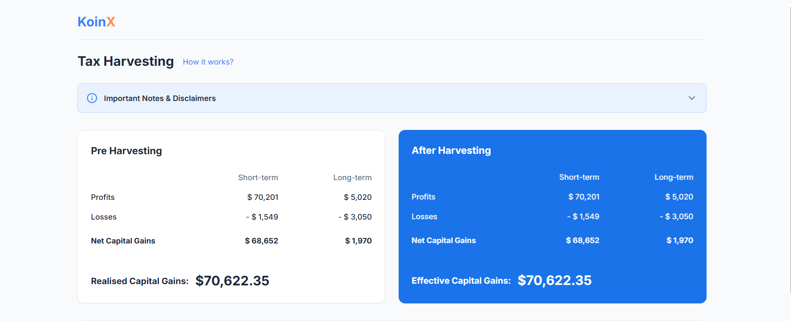
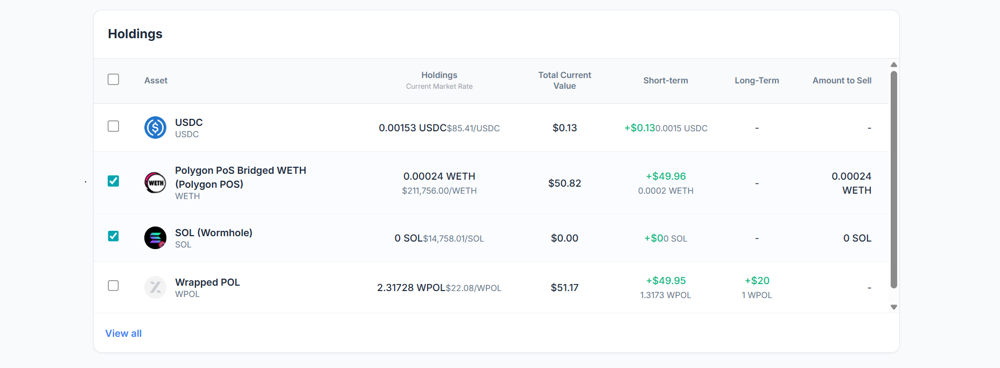

# Tax Loss Harvesting Dashboard

[](https://tax-loss-harvesting-seven.vercel.app/)
[](#)
[](#)

**Live Demo**: [https://tax-loss-harvesting-seven.vercel.app/](https://tax-loss-harvesting-seven.vercel.app/)

## 1. Project Overview

Tax-Loss Harvesting is the strategic practice of selling investment assets (like cryptocurrency or stocks) at a loss to offset realized capital gains liabilities, thereby reducing overall taxes owed.

This project is a robust, client-side calculation engine and dashboard that simulates this process. It allows users to view their portfolio, select underperforming assets, and dynamically recalculate their net capital gains in real-time to determine potential tax savings before executing trades.

## 2. Features

- **Real-Time Capital Gains Recalculation**: Instantly processes complex Short-Term and Long-Term buckets upon asset selection.
- **Pre vs. Post Harvesting Comparison**: Side-by-side visualization of current capital gains versus effective capital gains post-harvesting.
- **Multi-Asset Selection**: Robust checkbox logic with global "Select All" capabilities.
- **Data Table Integrity**: Includes built-in sorting (Short-term/Long-term), pagination logic (View All / View Less), and rigorous financial formatting.
- **Precision Formatting**: Large numbers are human-readable natively, with custom tooltip implementations revealing up to 4 floating-point exact values.
- **Responsive UI**: A highly polished, responsive interface built with TailwindCSS for a seamless desktop and mobile experience.

## 3. Tech Stack & Architecture

- **React (with Vite)**: Chosen for its blazing-fast HMR and highly optimized production builds compared to traditional Create React App configurations.
- **TypeScript**: Enforces strict domain modeling (especially critical for financial data like `CapitalGains` and `Asset` structures) using `verbatimModuleSyntax` for strict compilation.
- **TailwindCSS**: Utilized for its utility-first approach, enabling rapid, maintainable styling and design system tokenization without context-switching to CSS modules.
- **Zustand (State Management)**:
  - _Why Zustand over Redux?_ Zustand was strictly chosen to eliminate boilerplate. In a focused dashboard application, the heavy reducer/action infrastructure of Redux is an anti-pattern. Zustand provides a much simpler mental model, allowing direct state mutation patterns via hooks, which yields significantly faster development velocity and highly readable code without sacrificing performance.
- **Mock APIs (Promises)**: Simulates asynchronous network boundaries for fetching holdings and base capital gains.

## 4. State Management Approach

A core architectural pillar of this application is maintaining a **Single Source of Truth** with absolutely **no derived state** in the store.

The Zustand store tracks only the minimum required primitives:

1. `holdings` (Array of assets from the API)
2. `baseCapitalGains` (Base pre-harvesting metrics)
3. `selectedAssets` (Array of selected asset IDs)

**Why no derived state?**
Storing computed values (like net totals or post-harvesting values) inside the global store leads to synchronization bugs and double-counting. Instead, all dynamic metrics are aggressively recomputed on the fly using highly optimized pure functions wrapped in React's `useMemo`.

## 5. Core Logic & Calculation Engine

The calculation engine (`src/utils/calculations.ts`) processes financial data without mutating the base objects.

- **Profit/Loss Routing**: Gains are strictly evaluated. If a gain is positive, it is added to the `profits` bucket. If a gain is negative, its _absolute value_ is safely added to the `losses` bucket.
- **Pure Recomputation**: Instead of mutating the original API response, the engine deep-clones the base structure and recalculates the entire ledger from scratch on every state change.
- **Savings Condition**: The engine compares the total pre-harvesting net gains against the total post-harvesting net gains. If `post < pre`, the application dynamically renders the potential tax savings difference.

## 6. Project Structure

```text
├── src/
│   ├── components/    # Reusable, stateless UI components (Card, Tooltip, Header)
│   ├── features/      # Domain-specific logic and complex view assemblies (Dashboard)
│   ├── store/         # Zustand store setup and state interfaces
│   ├── utils/         # Pure calculation engines and formatting helpers
│   ├── services/      # Mock API endpoints handling async promise delays
│   └── types/         # Global TypeScript interfaces
```

## 7. Setup Instructions

1. **Clone the repository**

   ```bash
   git clone https://github.com/VasuDreamDebugger/TaxLossHarvesting.git
   cd TaxLossHarvesting/frontend
   ```

2. **Install dependencies**

   ```bash
   npm install
   ```

3. **Run the development server**
   ```bash
   npm run dev
   ```

## 8. Screenshots

### Tax Harvesting Engine Overview



### Dynamic Holdings Selection



## 9. Assumptions & Constraints

- **API Boundary**: A Mock API is utilized using asynchronous promises to simulate network latency; no real backend infrastructure is attached.
- **Precision Handling**: Very small floating-point anomalies (e.g., `5.04e-13`) generated by JavaScript math are systematically sanitized and treated as `0` in the UI to prevent display bugs.
- **Loss Display Logic**: While losses are strictly computed using negative values under the hood, they are uniformly displayed as positive, absolute numbers in the UI architecture as per standard financial ledgers.
- **Pagination**: The default holdings table enforces a visual constraint of 4 rows, expandable via the "View All" interaction.

## 10. Deployment

This project is configured and ready to be seamlessly deployed via **Vercel** or **Netlify**. Connect the repository to your hosting provider, ensuring the root directory is set to `frontend` (if deployed as a monorepo) and the build command is `npm run build`.
